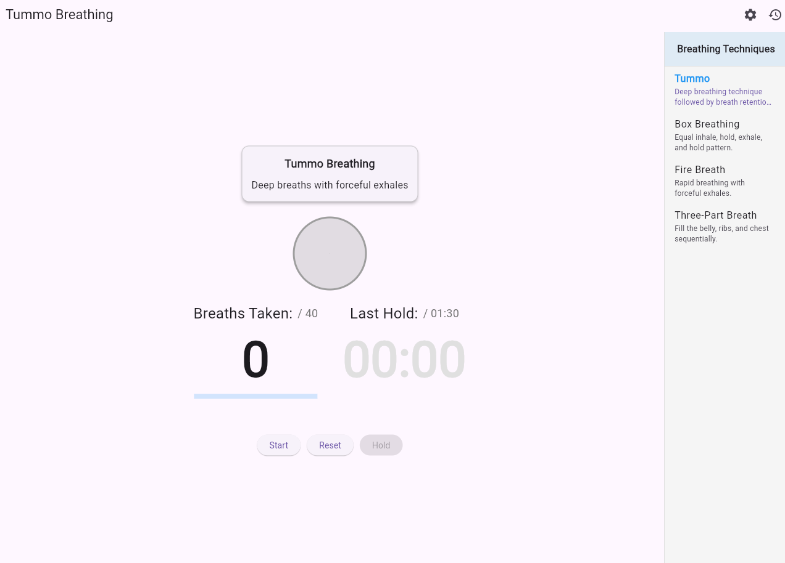
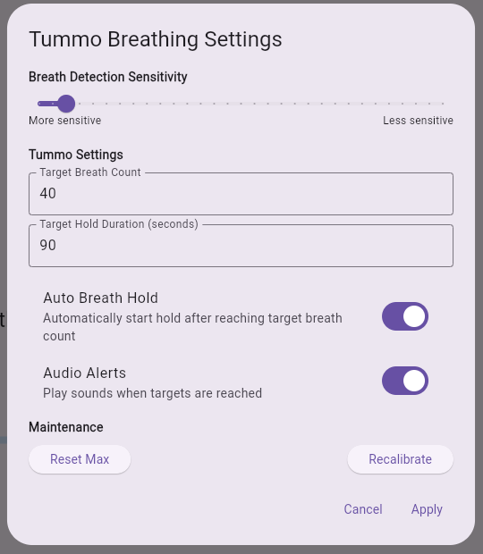
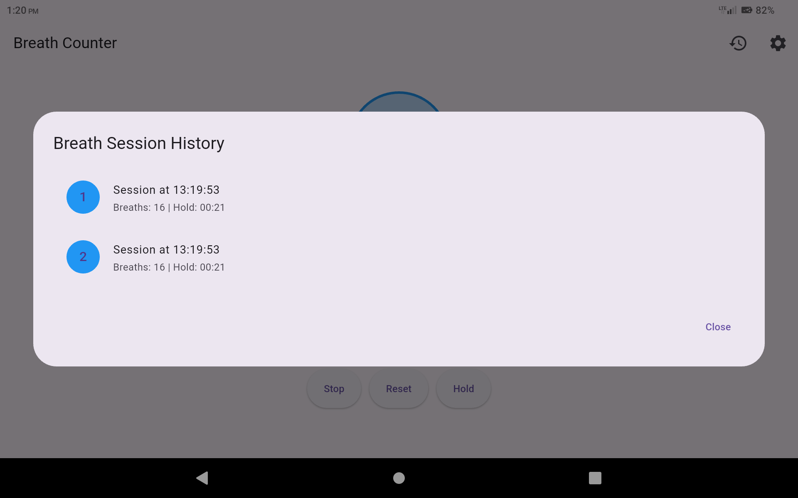

# Breath Counter

A Flutter application that detects and counts breaths using the device's microphone, while also providing breath-holding timer functionality.

[](https://breath-counter.fly.dev)



## Screenshots

| Main Screen | Breath Hold | History View |
|-------------|-------------|--------------|
|  |  |  |

## Features

- **Breath Detection**: Automatically detects and counts breaths using the device's microphone
- **Breath Visualization**: Visual feedback for breathing patterns
- **Breath Hold Timer**: Track breath-holding duration with a single tap
- **Session History**: Records breathing sessions with breath counts and hold durations
- **Sensitivity Adjustment**: Fine-tune breath detection sensitivity
- **Calibration**: Automatically calibrates to ambient noise levels
- **Breath State Detection**: Distinguishes between inhaling and exhaling phases

## Getting Started

### Prerequisites

- Flutter SDK 2.10.0 or higher
- Dart 2.16.0 or higher
- Android Studio / VS Code with Flutter extensions
- iOS or Android device with microphone access

### Installation

1. Clone the repository:
   ```
   git clone https://github.com/yourusername/breath_counter.git
   ```

2. Navigate to the project directory:
   ```
   cd breath_counter
   ```

3. Install dependencies:
   ```
   flutter pub get
   ```

4. Run the app:
   ```
   flutter run
   ```

## Usage

1. **Initial Setup**:
   - When first launched, the app will request microphone permissions
   - The app will automatically calibrate to the ambient noise level
   - Wait for "Calibration complete" message

2. **Breath Counting**:
   - Press "Start" to begin breath detection
   - Breathe naturally near your device's microphone
   - The circle will pulse with your breath, showing blue for inhales and green for exhales
   - The counter will increment with each detected breath

3. **Breath Holding**:
   - While in a counting session, press "Hold" to start the breath hold timer
   - Press "End Hold" to stop the timer when you resume breathing
   - Your hold duration will be recorded

4. **View History**:
   - Tap the history icon in the app bar to see your breathing sessions
   - Each session shows the number of breaths and hold duration

5. **Adjust Sensitivity**:
   - Tap the settings icon in the app bar
   - Use the slider to adjust breath detection sensitivity
   - "More sensitive" will detect quieter breaths
   - "Less sensitive" helps filter out background noise

## Architecture

The app follows a modular architecture with clear separation of concerns:

- **Models**: Data structures for the application
- **Services**: Core functionality like breath detection
- **Screens**: UI containers for different app sections
- **Widgets**: Reusable UI components

### Key Components

- `BreathDetector`: Core service that processes microphone input to detect breaths
- `BreathCounterScreen`: Main UI container that coordinates all widgets
- `BreathVisualization`: Visual feedback for breath detection
- `BreathControls`: UI controls for managing breath counting and holding

## Permissions

This app requires the following permissions:

- **Microphone**: Used for breath detection
   - Android: Add to AndroidManifest.xml
   - iOS: Add to Info.plist

## Dependencies

- [flutter_sound](https://pub.dev/packages/flutter_sound): Audio recording and processing
- [permission_handler](https://pub.dev/packages/permission_handler): Handling device permissions

## Troubleshooting

- **No breaths detected**: Try adjusting sensitivity or speak during a breath for more detectable sound
- **False detections**: Lower sensitivity or recalibrate in a quieter environment
- **Calibration issues**: Ensure you're in a relatively quiet environment during startup

## Contributing

1. Fork the repository
2. Create your feature branch (`git checkout -b feature/amazing-feature`)
3. Commit your changes (`git commit -m 'Add some amazing feature'`)
4. Push to the branch (`git push origin feature/amazing-feature`)
5. Open a Pull Request

## License

This project is licensed under the MIT License - see the LICENSE file for details.

## Acknowledgements

- [Flutter](https://flutter.dev/) - UI toolkit for building natively compiled applications
- [flutter_sound](https://pub.dev/packages/flutter_sound) - Audio processing capabilities