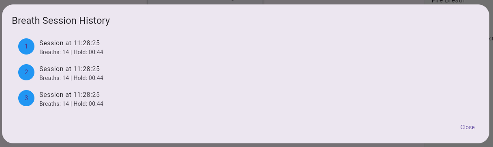

# Breath Counter

A Flutter application that detects and counts breaths using the device's microphone, while also providing multiple breathing techniques with guided instructions.

[](https://breath-counter.fly.dev)


## Screenshots

| Main Screen | Breath Hold | History View |
|-------------|-------------|--------------|
|  |  |  |

## Features

- **Multiple Breathing Techniques**:
   - **Tummo Breathing**: Deep breathing with breath counting and automatic breath hold
   - **Box Breathing**: Structured 4-phase breathing with guided timing
   - **Fire Breath**: Rapid breathing exercise with round tracking
   - **Three-Part Breath**: Sequential belly, rib, and chest breathing

- **Breath Detection**: Automatically detects and counts breaths using the device's microphone
- **Breath Visualization**: Visual feedback for breathing patterns
- **Breath Hold Timer**: Track breath-holding duration with a single tap
- **Session History**: Records breathing sessions with breath counts and hold durations
- **Sensitivity Adjustment**: Fine-tune breath detection sensitivity
- **Calibration**: Automatically calibrates to ambient noise levels
- **Guided Instruction**: Visual cues and text instructions for each breathing technique

## Getting Started

### Prerequisites

- Flutter SDK 2.10.0 or higher
- Dart 2.16.0 or higher
- Android Studio / VS Code with Flutter extensions
- iOS or Android device with microphone access

### Installation

1. Clone the repository:
   ```
   git clone https://github.com/yourusername/breath_counter.git
   ```

2. Navigate to the project directory:
   ```
   cd breath_counter
   ```

3. Install dependencies:
   ```
   flutter pub get
   ```

4. Run the app:
   ```
   flutter run
   ```

## Usage

1. **Initial Setup**:
   - When first launched, the app will request microphone permissions
   - The app will automatically calibrate to the ambient noise level
   - Wait for "Calibration complete" message

2. **Selecting a Technique**:
   - Choose from 4 different breathing techniques from the sidebar
   - Each technique has its own specific settings and parameters

3. **Tummo Breathing**:
   - Press "Start" to begin breath detection and counting
   - Breathe deeply near your device's microphone
   - The circle will pulse with your breath, showing blue for inhales and green for exhales
   - Press "Hold" to start a breath hold or wait for automatic hold after reaching the target count
   - Your breath count and hold duration will be recorded

4. **Box Breathing**:
   - Follow the guided instructions for equal-duration phases:
   - Inhale → Hold → Exhale → Hold
   - Customize phase durations in settings

5. **Fire Breath**:
   - Follow the instructions for rapid breathing
   - Complete multiple rounds with guidance
   - Adjust pace and round count in settings

6. **Three-Part Breath**:
   - Sequential breathing phases for belly, ribs, and chest
   - Guided timing for each phase
   - Customize all phase durations in settings

7. **View History**:
   - Tap the history icon in the app bar to see your breathing sessions
   - Each session shows the number of breaths and hold duration

8. **Adjust Technique Settings**:
   - Tap the settings icon in the app bar
   - Customize parameters specific to each breathing technique
   - For Tummo: Adjust breath detection sensitivity and targets

## Architecture

The app follows a modular architecture with clear separation of concerns:

- **Models**: Data structures for breathing techniques and history
- **Services**: Core functionality for breath detection and technique guidance
- **Screens**: Main container screens
- **Widgets**: Technique-specific UI components and controls

### Key Components

- `BreathDetector`: Core service that processes microphone input to detect breaths
- `BreathingTechniquesService`: Manages timing and instructions for each technique
- `BreathCounterScreen`: Main UI container that coordinates technique switching
- Technique-specific widgets for each breathing method

## Permissions

This app requires the following permissions:

- **Microphone**: Used for breath detection
   - Android: Add to AndroidManifest.xml
   - iOS: Add to Info.plist

## Dependencies

- [flutter_sound](https://pub.dev/packages/flutter_sound): Audio recording and processing
- [permission_handler](https://pub.dev/packages/permission_handler): Handling device permissions
- [just_audio](https://pub.dev/packages/just_audio): Audio feedback

## Troubleshooting

- **No breaths detected**: Try adjusting sensitivity or speak during a breath for more detectable sound
- **False detections**: Lower sensitivity or recalibrate in a quieter environment
- **Calibration issues**: Ensure you're in a relatively quiet environment during startup
- **Technique timing problems**: Adjust the timing parameters in the technique settings

## Contributing

1. Fork the repository
2. Create your feature branch (`git checkout -b feature/amazing-feature`)
3. Commit your changes (`git commit -m 'Add some amazing feature'`)
4. Push to the branch (`git push origin feature/amazing-feature`)
5. Open a Pull Request

## License

This project is licensed under the MIT License - see the LICENSE file for details.

## Acknowledgements

- [Flutter](https://flutter.dev/) - UI toolkit for building natively compiled applications
- [flutter_sound](https://pub.dev/packages/flutter_sound) - Audio processing capabilities